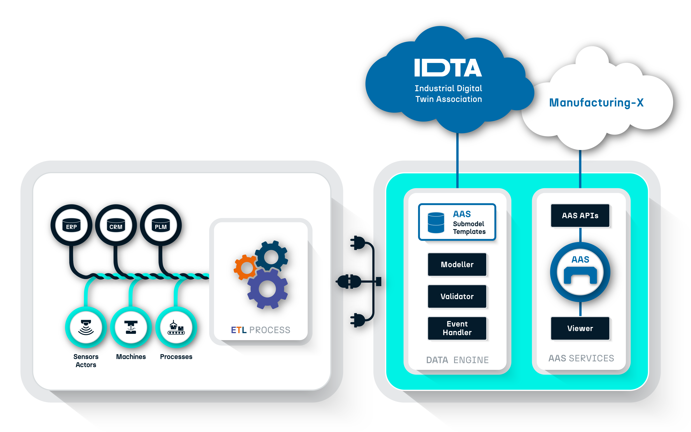

## Open Source Opening 2026-01-28 !

[Register here for opening session](https://events.teams.microsoft.com/event/f836cd67-33f2-43b1-8732-317022e03366@6e7c735d-01be-4294-8312-c84847d048d6)

**AAS.TwinEngine closes a crucial gap in the AAS ecosystem by enabling truly scalable, data‑driven integration of Digital Twins into modern data platforms and ETL pipelines.**

**It delivers high‑performance, enterprise‑grade handling of industrial data workloads and accelerates the implementation of AAS‑based Digital Twins at scale.**

**With its extensible plugin architecture, semantic‑ID–driven data flow, and robust security foundations, AAS.TwinEngine provides a transparent and future‑proof backbone for interoperable, production‑ready digital‑twin solutions.**
